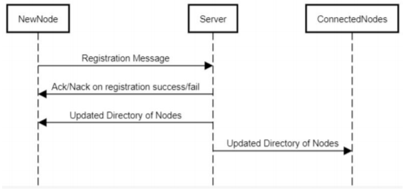
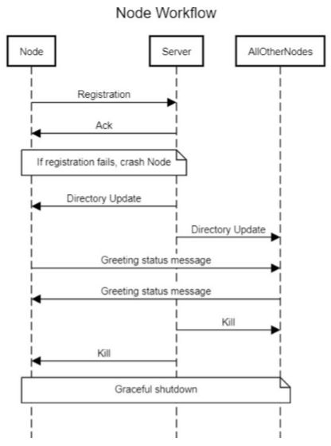

# TeamRP - Assignment 6 Part 1 Networking

## Project Requirements

The purpose of this assignment was to implement a prototype of the network communication layer for our distributed application. Our implementation consists of two main components, the Node and Server classes. The Server records registration of new nodes on the network and updates connected nodes with the node directory when a new node connects. The Node class connects to the rendezvous server, listens for directory updates, and communicates with other nodes on the network.

In order to handle different types of messages between the server and nodes, we made use of the provided Message class and its child classes Ack, Nack, Kill, Status, and Register. Each of these messages is serialized into an unsigned char* to be sent through our socket connections and deserialized back into an object on the other side.

### Registration Workflow

### Node Workflow

